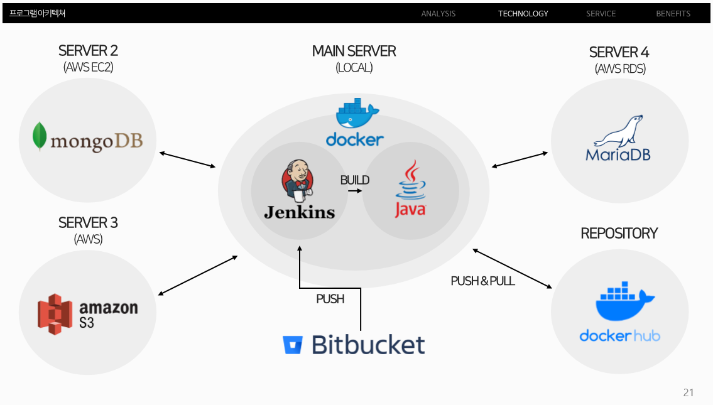
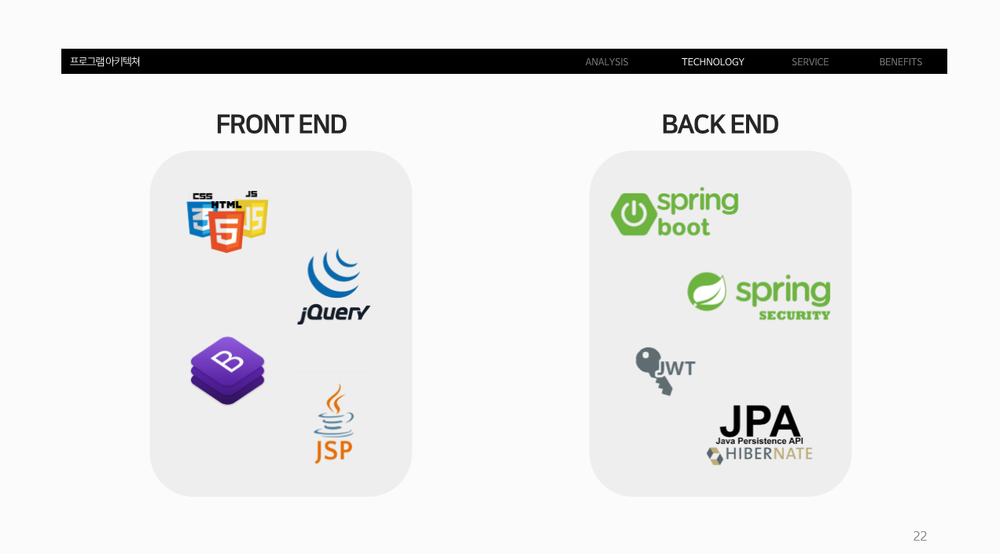
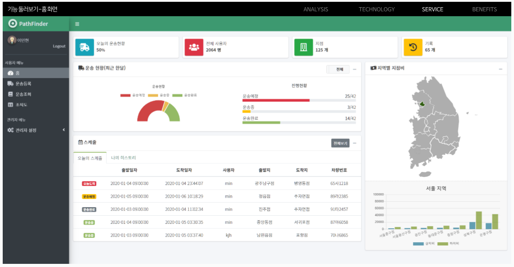
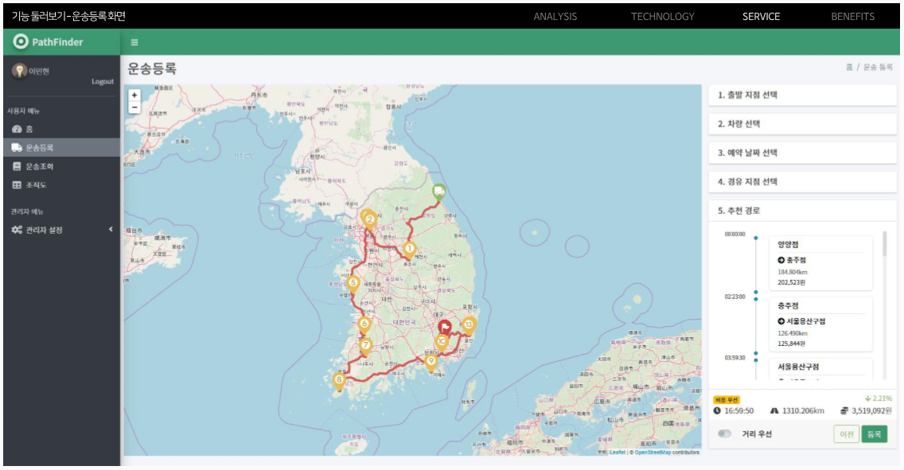
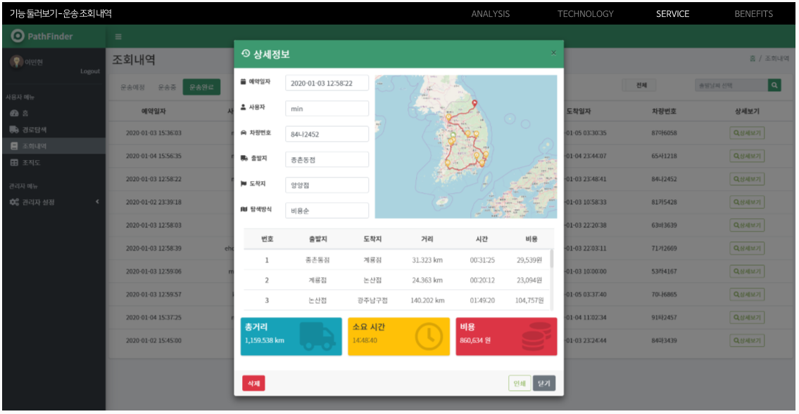

# 2020.06.22 현재 모든 서버 닫혀있는 상태.

PATHFINDER 소개 PPT : [BIT-PATHFINDER.pdf](https://github.com/9m1i9n1/pathfinder/files/4813191/BIT-PATHFINDER.pdf)

# Pathfinder Server URL

**http://218.39.221.89:8181/**

## Jenkins Server URL

**https://ecf6b635.ngrok.io**

## Port

**8787** : jenkins  
**8181** : pathfinder

# DB Information

## MariaDB

**Address** : pathfinder.ca5sinhqhzpv.ap-northeast-2.rds.amazonaws.com

**Password** : pathfinder1123!

## MongoDB

**Address** : 15.164.187.249

## 배송비 산출 공식

**(거리 _ 유틸비) + ( ( 상차비(출발지점) _ 0.4 ) + (하차비(도착지점) ) \* T 가중치)**
(차량 선택에 의해 창고 이용료가 비싸지기 때문에 차량마다 경로가 다를 수 있다)

~~크리티컬한 오류 : 창고이용료가 엄청 비싸거나 엄청 저렴할 경우, 거리에 상관없이 제일 나중에 가거나, 제일 먼저간다.~~

##### 유틸비

- 연비 : 1L = 1700원
- 인건비 : 1km = 500원

##### 시설 이용료

- 5천원 ~ 10만원

##### 트럭 종류

- 1T, 2.5T, 5T, 10T, 20T (T가중치 : T / 6)

### Docker파일 위치

- src/main/docker

## MariaDB Schema

**User Table**

| Column        | Content         | Type            |
| ------------- | --------------- | --------------- |
| user_index    | 유저 키         | BIGINT          |
| user_id       | 유저 아이디     | VARCHAR(20)     |
| user_pw       | 유저 비밀번호   | VARCHAR(20)     |
| user_name     | 유저 이름       | VARCHAR(10)     |
| branch_index  | 지점 키         | BIGINT (외래키) |
| area_index    | 지역 키         | BIGINT (외래키) |
| user_position | 유저 직책       | VARCHAR(10)     |
| user_email    | 유저 이메일     | VARCHAR(30)     |
| user_phone    | 유저 전화번호   | VARCHAR(20)     |
| user_created  | 아이디 생성일자 | DATETIME        |
| user_auth     | 유저 권한       | TINYINT         |

**Branch Table**

| Column       | Content        | Type        |
| ------------ | -------------- | ----------- |
| branch_index | 지점 키        | BIGINT      |
| branch_name  | 지점 이름      | VARCHAR(20) |
| branch_owner | 지점장         | VARCHAR(10) |
| branch_value | 지점 가중치    | INTEGER     |
| branch_addr  | 지점 주소      | VARCHAR(50) |
| branch_daddr | 지점 상세 주소 | VARCHAR(50) |
| branch_phone | 지점 전화번호  | VARCHAR(20) |
| branch_lat   | 지점 위도      | DOUBLE      |
| branch_lng   | 지점 경도      | DOUBLE      |

**Car Table**

| Column     | Content          | Type        |
| ---------- | ---------------- | ----------- |
| car_index  | 자동차 키        | BIGINT      |
| car_name   | 자동차 이름      | VARCHAR(20) |
| car_fuel   | 자동차 연비      | DOUBLE      |
| car_number | 자동차 번호판    | VARCHAR(10) |
| car_buy    | 자동차 구입 날짜 | DATETIME    |

**Area Table**

| Column     | Content   | Type        |
| ---------- | --------- | ----------- |
| area_index | 지역 키   | BIGINT      |
| area_name  | 지역 이름 | VARCHAR(10) |

## MongoDB Schema

**history Table**

| Column     | Content        | Type     |
| ---------- | -------------- | -------- |
| regdate    | 등록 날짜      | Date     |
| username   | 유저ID         | String   |
| carIndex   | 차량번호       | Int64    |
| imgSrc     | S3의 이미지url | String   |
| dep        | 출발지         | String   |
| arvl       | 도착지         | String   |
| dist       | 총 거리        | Double   |
| fee        | 총 요금        | Int32    |
| time       | 총 시간        | String   |
| dlvrdate   | 출발 날짜      | Date     |
| arrivedate | 도착 날짜      | Date     |
| routes     | 경로(ObjectID) | ObjectId |
| sortType   | 정렬 타입      | String   |

**routes Table**

| Column | Content | Type  |
| ------ | ------- | ----- |
| detail | 경로    | Array |

**detail Collection**

| Column | Content        | Type   |
| ------ | -------------- | ------ |
| detail | 경로           | Array  |
| rdist  | A,B 사이 거리  | Double |
| rtime  | A,B 사이 시간  | Double |
| rdep   | A의 이름(출발) | String |
| rarvl  | B의 이름(도착) | String |
| rfee   | A,B 사이 비용  | Int32  |
